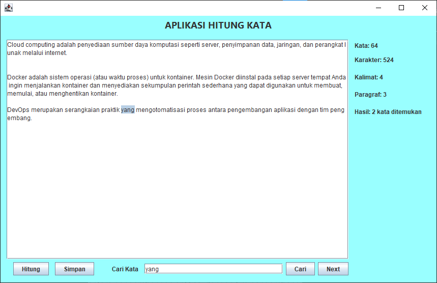
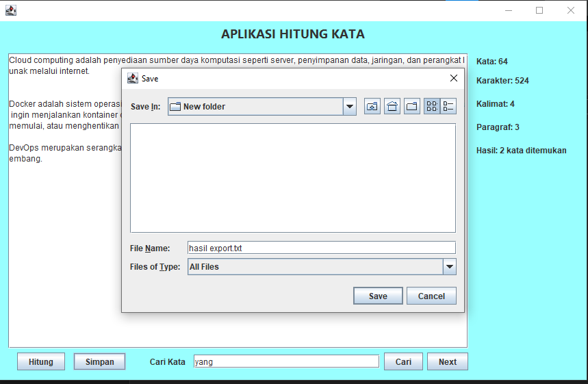
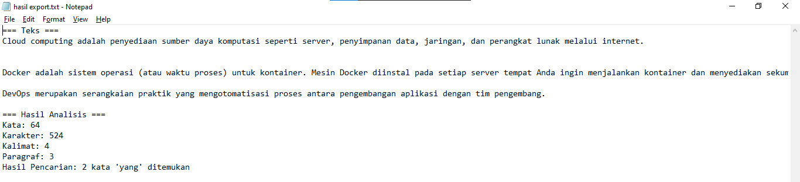

# Aplikasi Penghitung Kata

## my Bio

Nama: Muhammad Junaidi 
NPM: 2210010097 
Kelas: 5B TI Reg BJB 

## Demo
1. Hitung dan cari kata 'yang'

2. Klik tombol simpan dan pilih lokasi menyimpan file dan tentukan nama file

3. Hasil simpan
- File 

- Isi file 
